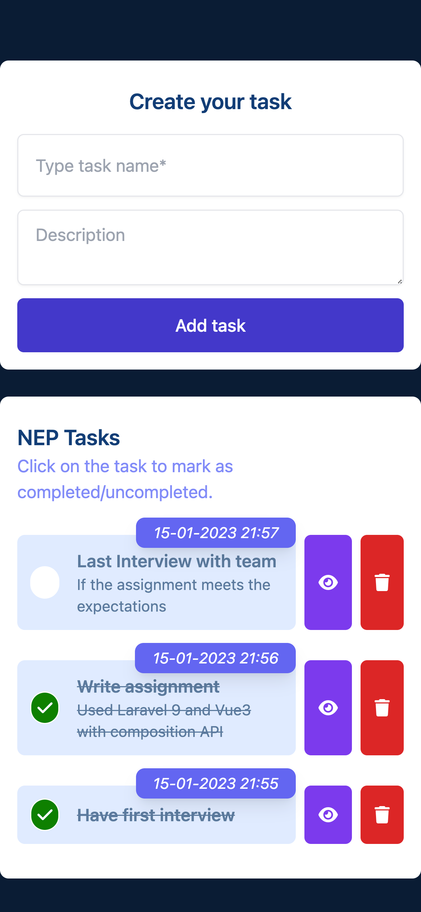
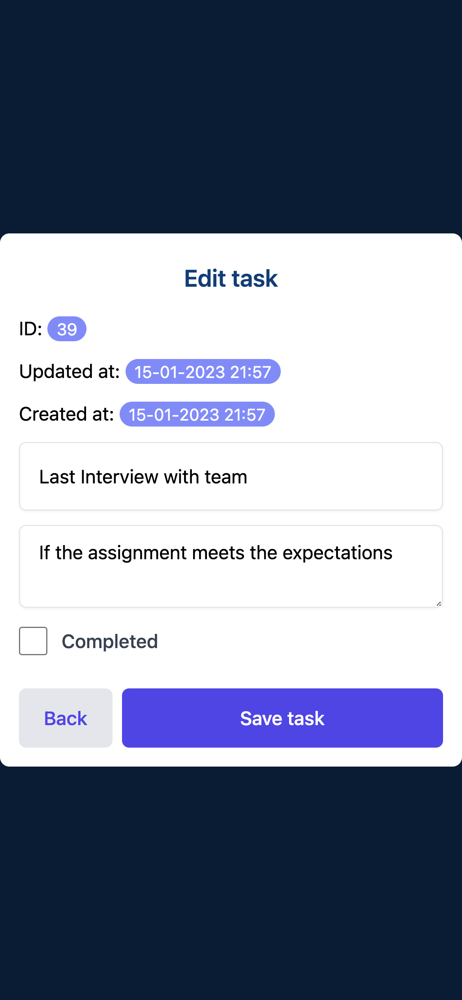
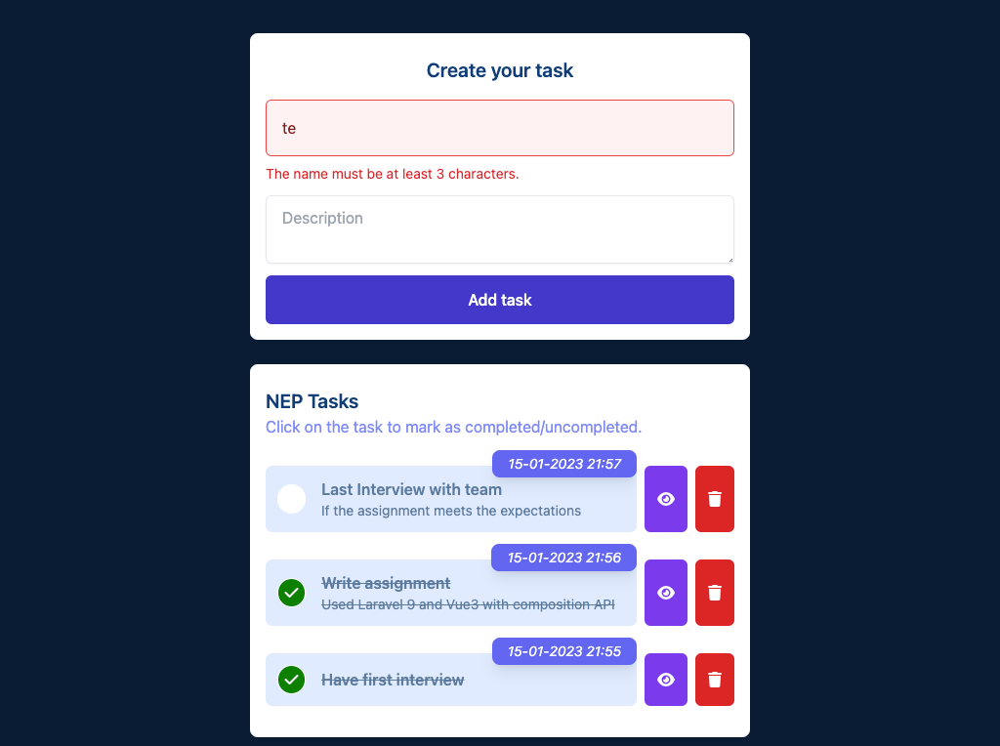

## Steps to run the project  
`composer install`   
`cp .env.example .env`  
edit mysql connection  
`php artisan migrate`  
`npm i`  
`npm run build`  
`php artisan serve`  
### For running the tests:
`php artisan test`   
## Postman
I have included a postman json collection if you want to test the backend separately  
## Screenshots
home   

edit task  

desktop view + validation  
